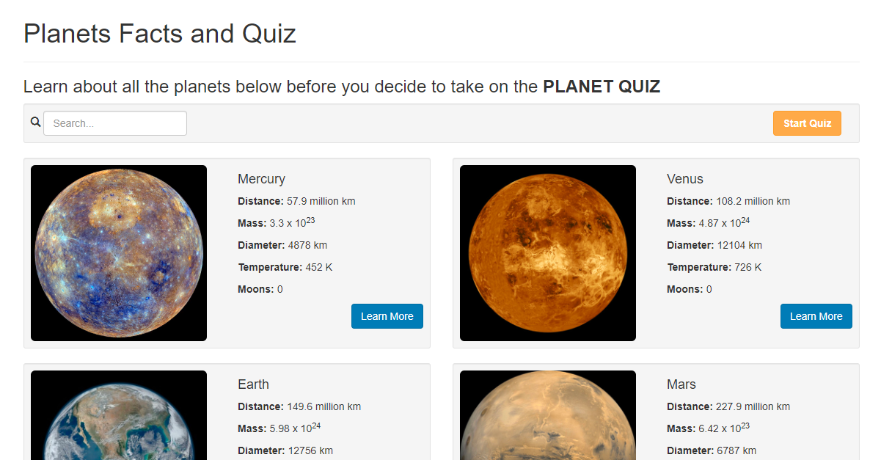
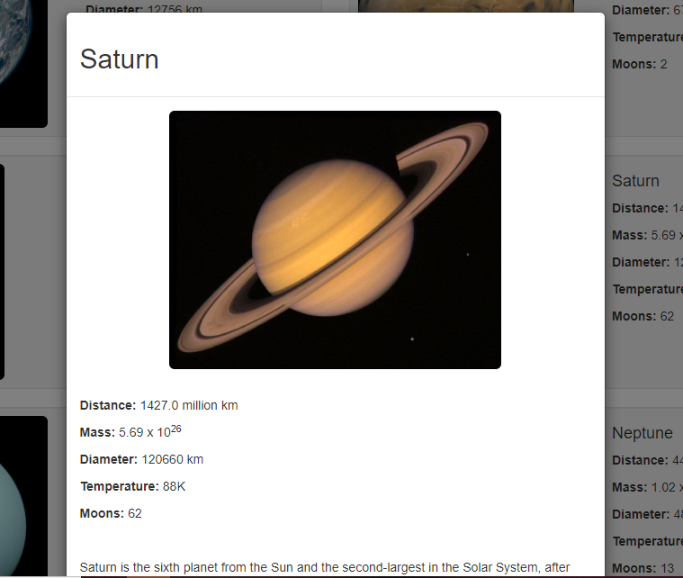
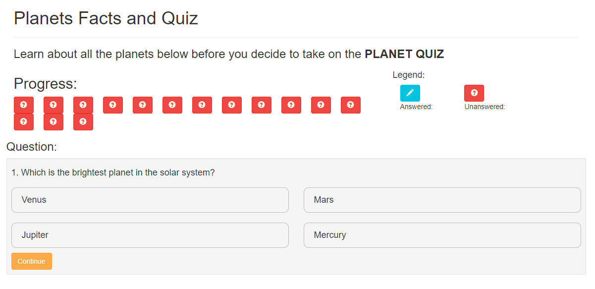
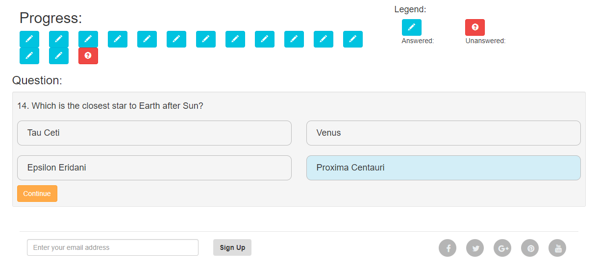
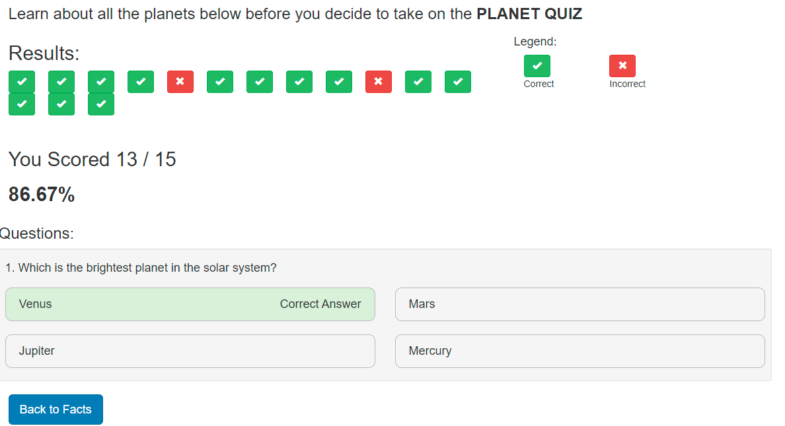

AngularJS Universe Quiz and Facts
===============================================================

An AngularJS mini project without any backend or database
that contains some facts to learn about universe and take some 
quiz questions.

AngularJS concepts used in this are
- Two way data binding
- Dependency Injection (Injecting services that the components depend on)
- How we can use DataServices to mock backend APIs.
- Using directives like ng-repeat, ng-class, ng-if and so on
- Angular filters

Along with that we'll also know more about 
- Transitions, Transforms and Animations using CSS
- More Bootstrap


---------------------------------------------------------------

|                           |                                   |
|---------------------------|-----------------------------------|
| Developer                 | Avinash Sorab                     |
| Languages                 | HTML5, CSS3, JavaScript           |
| Frameworks and Libraries  | jQuery, Bootstrap, AngularJS (v1) |

<!-- TOC -->

- [Installation Instructions](#installation-instructions)
- [Screenshots](#screenshots)

<!-- /TOC -->

## Installation Instructions

- Make sure you have node and npm installed locally in your system.

- Run the below command
```
npm install -g live-server
```

- Run the below command to install all the project dependancies locally from the package.json
```
npm install
```

- Open the project in visual studio code and navigate to the project folder in the integrated terminal

- Run the below command
```
live-server
```

- You should see the server start up on your computer locally on the port 8080

## Screenshots












All credits to HungryTurtleCode Tutorials
Follow him at https://www.youtube.com/channel/UC7Vxnf06GP6w42Lg3TQLXSw


> Feel free to reach me out for any help in installation at avinashsp93@gmail.com